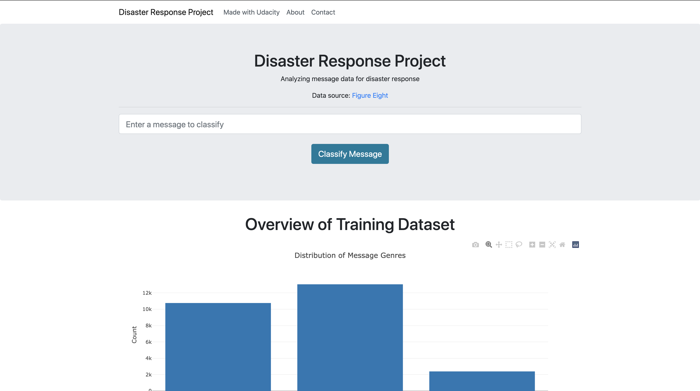
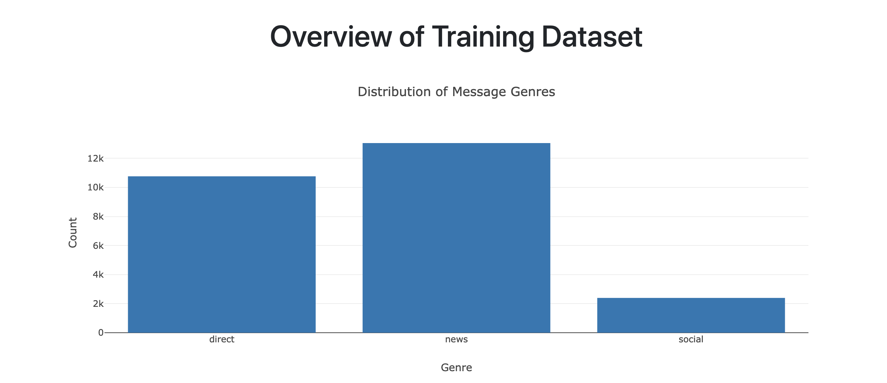
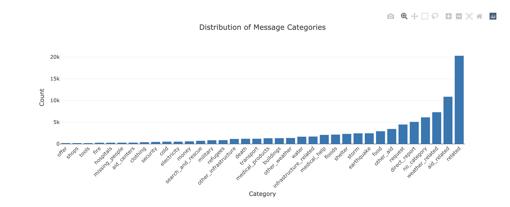
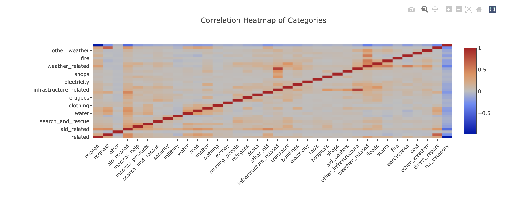
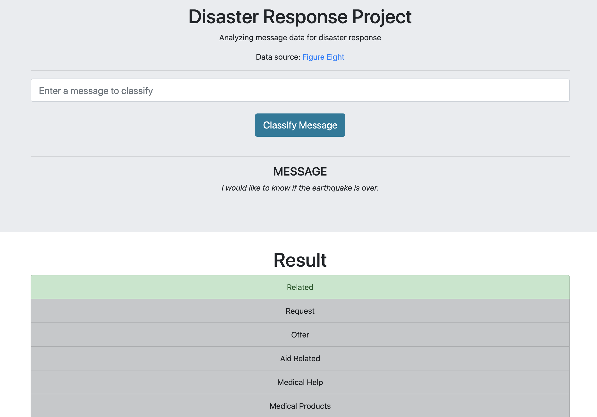
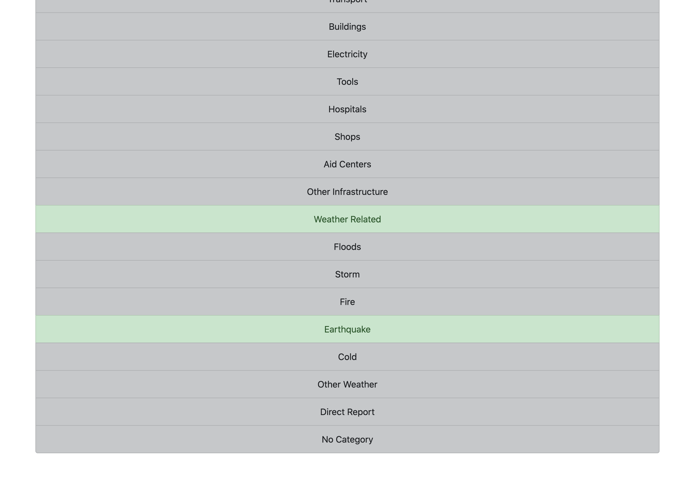
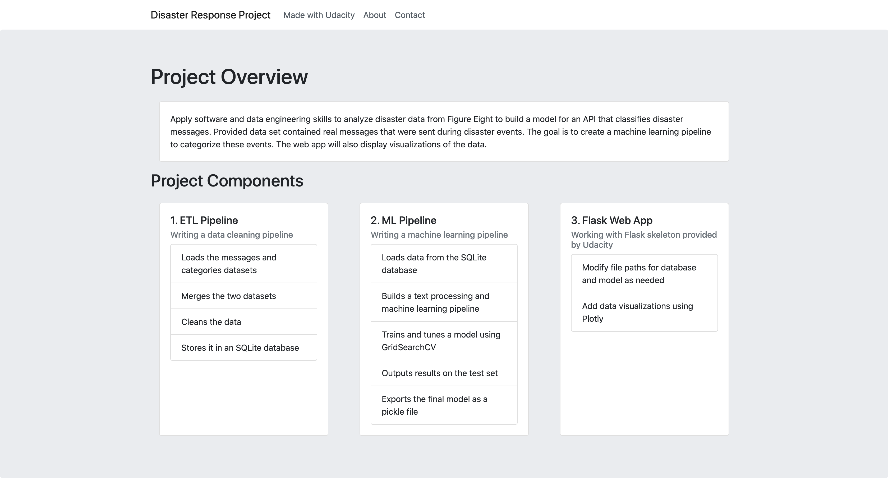

# Disaster Response Pipeline Project

## Motivation:

---

Apply software and data engineering skills to analyze disaster data to build a model for an API that classifies disaster messages. Using the web app an emergency worker can input a new message and get classification result in several categories such as "water", "fire", "food", etc. Such classification can help emergency workers notify an appropriate disaster relief agency.

## Files in the repository:

---

app 
| - templates  
| |- master.html # main page of web app  
| |- go.html # classification result page of web app  
| |- about.html # about page of the project  
|- run.py # Flask file that runs app  
data  
|- disaster_categories.csv # data to process  
|- disaster_messages.csv # data to process  
|- process_data.py  
|- DisasterResponse.db # database to save clean data to  
|- ETL Pipeline Preparation.ipynb  
models  
|- train_classifier.py  
|- ML Pipeline Preparation (1).ipynb  
|- classifier.pkl # saved model  
README.md  
requirements.txt #list of dependencies

## Instructions:

---

1. Install dependencies in your virtual environment by running:

   `conda create --name <env> --file <requirements.txt>`

2. Run the following commands in the project's root directory to set up your database and model.

   - To run ETL pipeline that cleans data and stores in database
     `python data/process_data.py data/disaster_messages.csv data/disaster_categories.csv data/DisasterResponse.db`
   - To run ML pipeline that trains classifier and saves
     `python models/train_classifier.py data/DisasterResponse.db models/classifier.pkl`

     Note: initial model training may take a few hours depending on your machine.

3. Run the following command in the app's directory to run your web app.
   `python run.py`

4. Go to http://0.0.0.0:3001/

## Web application screenshots:

After entering the following message: "I would like to know if the earthquake is over."

## Result:

---

Web app that prompts users to enter a message and returns corresponding category predictions based on the ML pipeline.

| Category               | precision | recall | f1-score | support |
| ---------------------- | --------- | ------ | -------- | ------- |
| related                | 0.76      | 1.00   | 0.86     | 6532    |
| request 0.84           | 0.18      | 0.29   | 1510     |
| offer                  | 0.00      | 0.00   | 0.00     | 48      |
| aid_related            | 0.78      | 0.27   | 0.40     | 3578    |
| medical_help           | 0.65      | 0.02   | 0.04     | 682     |
| medical_products       | 0.83      | 0.01   | 0.02     | 429     |
| search_and_rescue      | 0.75      | 0.01   | 0.03     | 233     |
| security               | 0.00      | 0.00   | 0.00     | 142     |
| military               | 0.50      | 0.00   | 0.01     | 283     |
| water                  | 0.66      | 0.70   | 0.68     | 514     |
| food                   | 0.76      | 0.69   | 0.72     | 943     |
| shelter                | 0.83      | 0.30   | 0.44     | 752     |
| clothing               | 0.83      | 0.08   | 0.15     | 118     |
| money                  | 0.00      | 0.00   | 0.00     | 206     |
| missing_people         | 0.33      | 0.01   | 0.02     | 95      |
| refugees               | 0.75      | 0.02   | 0.04     | 280     |
| death                  | 0.90      | 0.02   | 0.04     | 396     |
| other_aid              | 0.71      | 0.00   | 0.01     | 1156    |
| infrastructure_related | 0.00      | 0.00   | 0.00     | 563     |
| transport              | 0.81      | 0.05   | 0.10     | 405     |
| buildings              | 0.78      | 0.08   | 0.15     | 434     |
| electricity            | 0.75      | 0.03   | 0.07     | 176     |
| tools                  | 0.00      | 0.00   | 0.00     | 48      |
| hospitals              | 0.00      | 0.00   | 0.00     | 95      |
| shops                  | 0.00      | 0.00   | 0.00     | 44      |
| aid_centers            | 0.00      | 0.00   | 0.00     | 100     |
| other_infrastructure   | 0.00      | 0.00   | 0.00     | 372     |
| weather_related        | 0.93      | 0.34   | 0.49     | 2386    |
| floods                 | 0.91      | 0.35   | 0.50     | 690     |
| storm                  | 0.82      | 0.07   | 0.13     | 807     |
| fire                   | 0.33      | 0.01   | 0.02     | 100     |
| earthquake             | 0.91      | 0.68   | 0.78     | 812     |
| cold                   | 0.50      | 0.03   | 0.05     | 177     |
| other_weather          | 0.50      | 0.00   | 0.01     | 452     |
| direct_report          | 0.80      | 0.11   | 0.19     | 1691    |
| no_category            | 0.00      | 0.00   | 0.00     | 2058    |
| micro avg | 0.78 | 0.37 | 0.51 | 29307 |
| macro avg | 0.53 | 0.14 | 0.17 | 29307 |
| weighted avg | 0.68 | 0.37 | 0.40 | 29307 |
| samples avg | 0.73 | 0.42 | 0.48 | 29307 |

## Licensing and Acknowledgements:

---

The dataset was provided by Figure Eight and contained real messages that were sent during disaster events.
